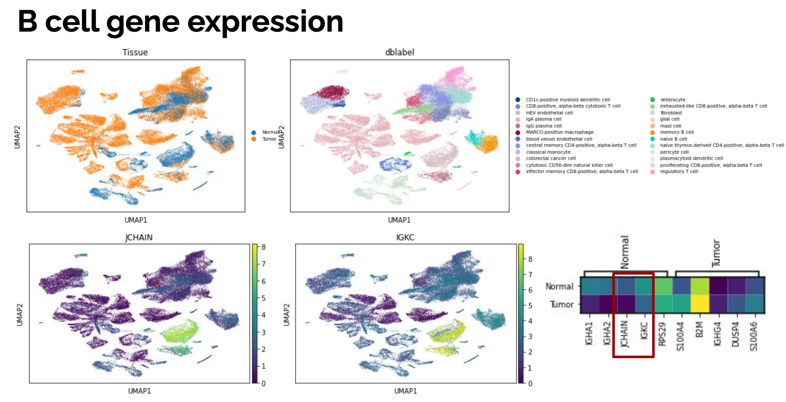

# Single Cell Sequencing Analytics for Drug Discovery

2022 summer school project to develop and assess new metrics for single cell sequencing data for drug discovery pipelines. The project output contains 3 components:

1. Report: `report-scSeq-and-drug-discovery.pdf` 
2. Jupyter Notebook containing corresponding analysis and resluts : `scSeq-Correlation-Metrics§.ipynb`
3. scSeq `QC Algorithm 1` to determine if cell-type labeled contain cononical genes corresponding to other standard cell types (i.e. cell labeled Plasma cell but expressing CD4)

